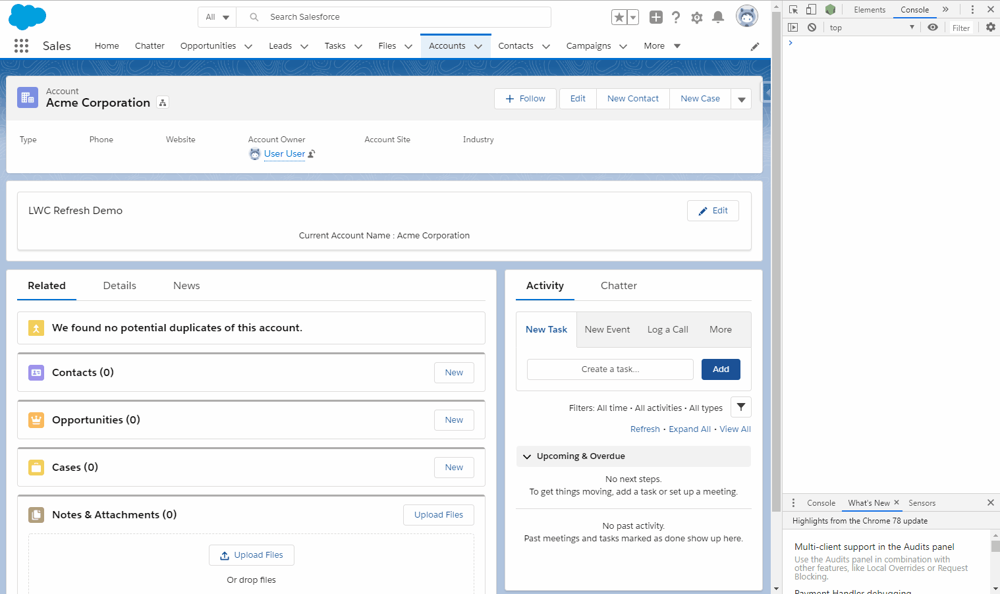
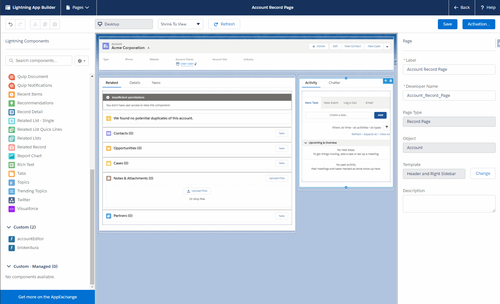

# LWC Refresh Demo

This project is meant to illustrate how to broker communications across all Aura and Lightning Web Components within the context of lightning page builder. The classic example of this is the 'e.force:refreshView' event, but in theory this could be used to broker all communiations between Aura application events and Lightning Web Components.

### Simple Demonstration
Here is a simple demonstration of a Lightning Web Component called accountEditor listening refreshes from other components, as well as initializing the refresh.

Note the chrome console log statements: 
* The accountEditor will log 'Listening to Refresh for LWC' when another component fires the Aura e.force:refreshView event
* The accountEditor will log 'Calling Refresh from LWC' when it is initialixing the refresh itself

### Sequence Diagrams
There are two basic flows for brokering in this way:

##### Aura Initiated

##### LWC Initiated

### Adding Components to Lightning Page
This approach will only work if the brokerAura component is somewhere (location does not matter) on the Lightnig page.
In this example, I have placed it above the highlights panel.

